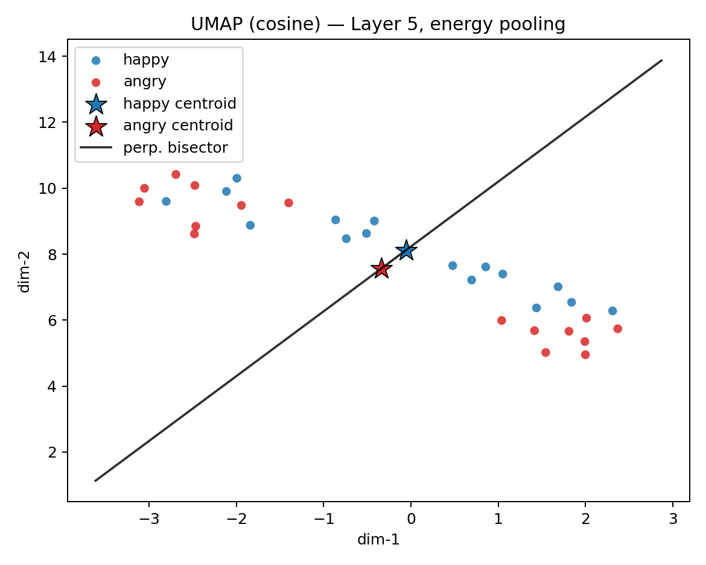
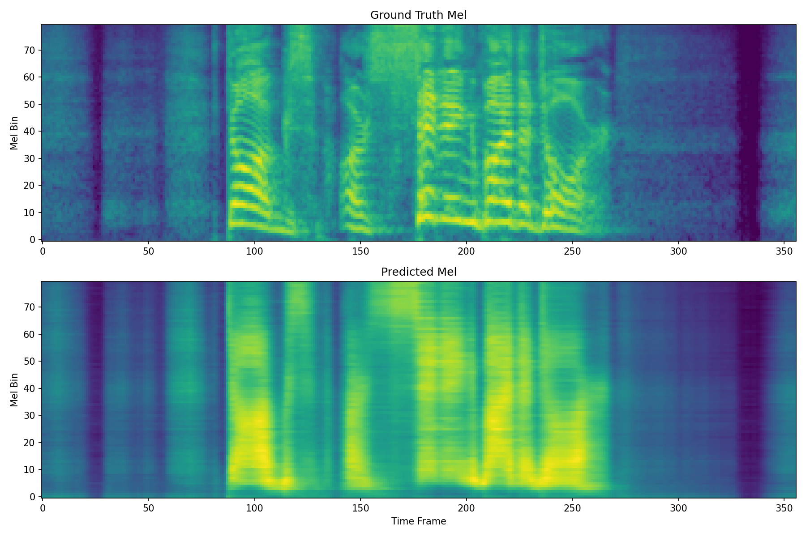
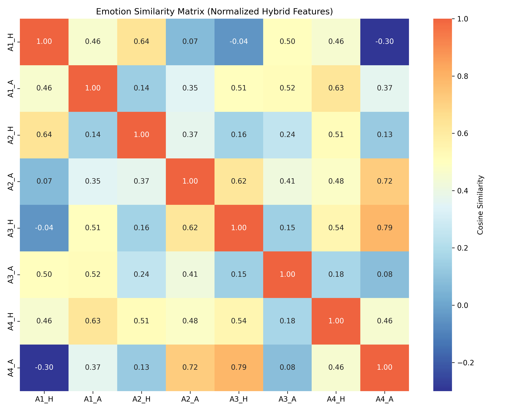
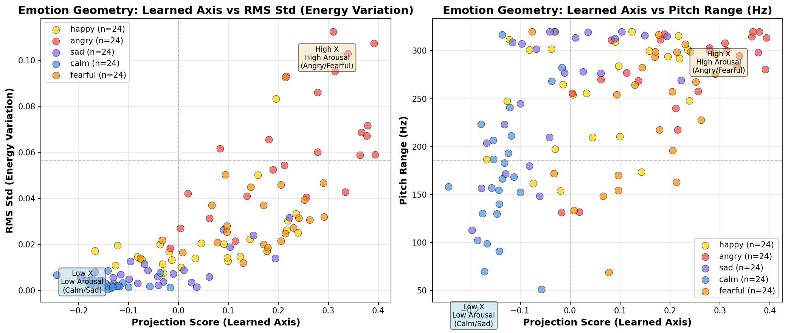

# emotion latent space experiment

probing wav2vec2's internal layers to see if emotion is an emergent geometric property of its latent space

**finding:** emotion is basically a straight line in wav2vec2's layer 5 latent space. you compute it as `angry_embedding - calm_embedding`, average across speakers, and add that one 768-dim vector to new speech to make it sound more (or less) emotional. it even works on speakers the axis was never built from.



*UMAP of layer 5 embeddings. emotions cluster on their own, from a model trained with zero emotion labels.*

## what is this

so i had this idea - wav2vec2 is trained on raw audio with no labels at all, just self-supervised learning. but when you look at the embeddings it produces... emotional speech clusters together! angry samples end up near other angry samples. calm near calm.

which got me thinking: is there a direction in this space that corresponds to emotion? maybe you could just do `embedding + anger_direction` and make speech sound angrier?

turns out: yes. and it works way better than i expected!! wohoo

## how it works

i took the CREMA-D dataset (actors saying the same sentences with different emotions) and extracted wav2vec2 embeddings from layer 5. for each actor, i computed `angry_embedding - calm_embedding`. then averaged all those difference vectors together.

that gives you one 768-dim vector - the "emotion axis".

now for any new audio:
1. extract its wav2vec2 embedding
2. add some multiple of the emotion axis to it
3. run through a mapper network i trained (converts embeddings back to mel spectrograms)
4. vocode with hifi-gan

and it actually shifts the emotion. not perfectly - there's some audio quality loss - but you can clearly hear the difference.



*mel spectrograms before vs after steering along the emotion axis.*

## whats in here

the important files:
- `tts.py` - text to speech with emotion blending
- `scripts/core/emotion_steer_final.py` - the actual steering code
- `scripts/core/train_mapper_final.py` - training the embedding→mel mapper
- `scripts/wav2vec2_experiments/build_global_axis.py` - builds the emotion axis

pretrained stuff in `models/`:
- `emotion_axis_layer5.npy` - the emotion direction (768 floats)
- `hifigan/` - vocoder weights

data:
- `crema_d_data/` - the dataset
- `embeddings/` - precomputed wav2vec features
- `checkpoints/` - mapper model weights

## usage

steer existing audio:
```bash
python scripts/core/emotion_steer_final.py --input voice.wav --delta 0.5 --output out.wav
```
delta goes from -1 (calmer) to +1 (angrier)

tts with emotion control:
```bash
python tts.py --text "whatever" --ref_calm calm.wav --ref_angry angry.wav --alpha 0.3 --out out.wav
```

## hear it

the whole point is sound, so here's some outputs. (github doesn't autoplay `.wav`, so these just download when you click. if you want little play buttons inline you can attach them to a Release.)

- [`test_neutral.wav`](test_neutral.wav) - baseline, unsteered
- [`test_neural_calm.wav`](test_neural_calm.wav) - steered toward calm
- [`test_hifigan_calm_v2.wav`](test_hifigan_calm_v2.wav) - calm steered, hifi-gan vocoded
- [`pipeline_test_UPGRADED.wav`](pipeline_test_UPGRADED.wav) - full pipeline, upgraded mapper
- [`gt_vocode.wav`](gt_vocode.wav) - ground truth vocoder roundtrip (the quality ceiling for this setup)

## interesting findings

- **the emotion direction is actually consistent across speakers.** mean pairwise cosine between the actor difference-vectors is 0.19 ± 0.18 (random 768-dim vectors sit around 0), and the averaged axis has resultant length R = 0.63 (1.0 = perfect agreement, 0 = random). so the actors mostly point the same way. real agreement, not total, but a genuine shared axis and not noise. (this is just the 4 actors that had aggregate layer 5 pairs, doing all of them would tighten it up.)
- layer 5 works best. earlier layers dont have enough semantic info, later layers hurt audio quality
- the axis generalizes across speakers - even ones the model never saw during axis construction
- you can interpolate smoothly along the axis, its not just binary
- the emotion structure emerges purely from self-supervised pretraining on unlabeled audio



*cosine similarity between emotion centroids. same-emotion blocks light up.*



*moving along the axis tracks arousal, so the steering follows the emotion geometry instead of being random.*

## what didnt work (and why)

i tried to do real-time emotion morphing but hit a wall. after a lot of debugging i realized the problem is fundamental:

**emotions in speech are conveyed through prosody (pitch contour, timing, rhythm) - not spectral content.**

when someone says "i'm fine" angry vs sad:
- the words/phonemes are identical (same spectral content)
- the pitch, timing, intensity are different (prosody)

mel spectrograms dont directly encode pitch contour or timing - theyre basically a snapshot of "what frequencies are present." so modifying mels is like trying to change the emotion of a sentence by adjusting an EQ. you can make it brighter or darker, but you cant change *how* it was said.

the wav2vec → mel → vocoder approach is fundamentally limited because wav2vec encodes *what* is said (its designed for speech recognition), not *how* its said emotionally.

**what would actually work:**
- explicit prosody modeling - predict and modify F0 (pitch), duration, energy separately
- end-to-end emotional TTS - models like StyleTTS2 or VITS trained for this
- voice conversion models - like OpenVoice that disentangle content from style

so yeah, the axis math is cool, but turning it into a practical emotion morpher needs a different approach entirely. 😄

## dependencies

torch, transformers, librosa, soundfile, TTS (coqui), numpy
